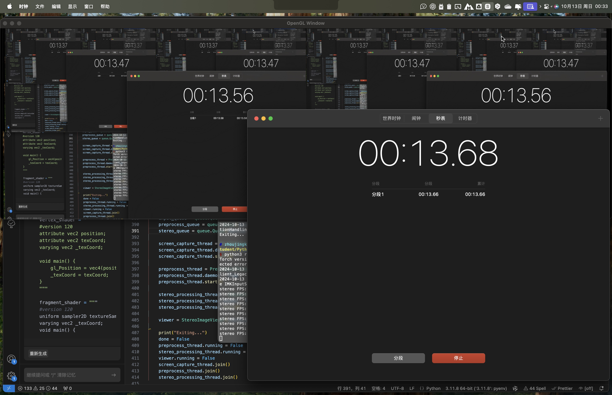

<div align="center">

<h1> Stereopsis Anything </h1>

[EN](readme.md) | [中文](doc/readme_cn.md)


</div>

**Stereopsis Anything** can convert 2D content on the screen in real-time into stereoscopic images (spatial videos) that are theoretically compatible with various AR/VR glasses, such as Rayneo Air 1s/2s, X1, X2, Nreal Air, etc. The project is specifically optimized for macOS and is designed to work best on Mac systems. But it can still work with windows and linux I think.


## Features

- Real-time conversion of 2D content on the screen to stereoscopic images.
- Optimized for macOS.
- Utilizes Pyobjc to call Screen Capture Kit for direct access to screen shots from the image buffer of macOS.
- A specially optimized CoreML [Depth Anything V2](https://github.com/DepthAnything/Depth-Anything-V2) model that supports tensor input/output.
- Renders graphics directly on the GPU using OpenGL.
- Achieves 33 FPS with approximately 100ms latency on M3 Max, suitable for smooth video playback.
- Achieves around 15 FPS on M2, slightly laggy but still usable :satisfied:.


## Technology Stack

- **Python**: For development and application building.
- **[Pyobjc](https://github.com/ronaldoussoren/pyobjc/tree/master)**: To interact with macOS system-level functionalities.
- **[coremltools](https://github.com/apple/coremltools/tree/main)**: For deep learning model inference.
- **[OpenGL](https://pyopengl.sourceforge.net/)**: For efficient graphics rendering.
- **[ScreenCaptureKit](https://developer.apple.com/documentation/screencapturekit?language=objc)**: For capturing screen content.
- **[Pytorch](https://pytorch.org/)**: For high performance MPS acceleration.
- **[mss](https://python-mss.readthedocs.io/index.html)**：Capture screen for windows and linux.

## Installation Guide

1. Clone the repository to your local machine:
   ```bash
   git clone https://github.com/zjkhurry/stereopsis-anything.git
   cd stereopsis-anything
   ```

2. Install dependencies:
   For MacOS:
   ```bash
   pip3 install -r requirements.txt
   ```
   For Winsows/Linux
    ```bash
   pip3 install -r requirements_all.txt
   ```
   And make sure you have installed the [CUDA Toolkit](https://developer.nvidia.com/cuda-toolkit) and [cuDNN](https://developer.nvidia.com/cudnn) correctly.

## Usage Guide

### MacOS
Run the main program:
```bash
python3 run.py
```
The program will crop the central 16:9 aspect ratio region of the main display (since MacBook screens are not 16:9, this crops the display area for a full-screen 1080p video) and create a window displaying the stereoscopic video (3840 x 1080). Set your AR glasses to 3D mode, extend the screen, and then drag the stereoscopic video window to the extended screen for full-screen display. Press 'q' to exit the application and use ',' and '.' to modify the depth of the stereoscopic image.

You can also try to use Nerual Engine (NE) to run the AI model, this may improve the performance on M1, M2 chips
```bash
python3 run.py -c "NE"
```

And a slower screen capture speed may also help，i.e. set speed to 15 fps
```bash
python3 run.py -f 15
```

You can combine them as 
```bash
python3 run.py -f 15 -c "NE"
```

### Windows/Linux
Run the main program:
```bash
python3 run_all.py
```
The program will capture the main display and create a window displaying the stereoscopic video (3840 x 1080). Set your AR glasses to 3D mode, extend the screen, and then drag the stereoscopic video window to the extended screen for full-screen display. Press 'q' to exit the application and use ',' and '.' to modify the depth of the stereoscopic image.

## Notes

- Ensure your macOS version is greater than macOS 13.0 and that your Mac device supports OpenGL 2.1.
- This code has been tested with Python 3.11, but there might be some issues if you use a different version of Python.
- Due to high performance requirements, it is recommended to use supported hardware devices (such as M3 Max or M2 Max chips) for the best experience.
- Testing has shown that running the model on the GPU is significantly faster than using the Neural Engine (NE) on M3 Max, but on M2, using NE is faster than using the GPU. Feel free to try both.
- If you need personalized settings, such as modifying the screen capture area, changing the CoreML execution device (GPU, NE), or adjusting the output frame size, use the following command:
```bash
python3 run.py -h
```

---

> NOTICE:
>
> This project is released under the Apache License 2.0. For personal use, you are free to use, modify, and distribute this software according to the terms of the Apache License 2.0.
However, for commercial use, prior written permission from the author is required. Please contact the author at [zjkharry@gmail.com] for further information and to obtain the necessary authorization.
Thank you for respecting the author's rights and the terms of the license.